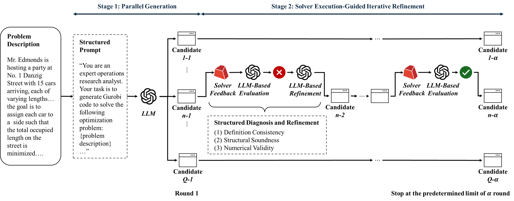

# ECO: Exploration and Correction for Optimization Modeling with LLMs

ECO (Exploration-Correction Optimization) is a novel zero-shot framework that leverages Large Language Models (LLMs) for automated optimization modeling. By integrating parallel and sequential scaling under the inference-time scaling paradigm, ECO forms a hybrid mechanism that effectively addresses linguistic ambiguity and solver code generation challenges. ECO demonstrates that modern LLMs, when equipped with effective external feedback mechanisms, exhibit substantial domain expertise in optimization modeling. Our framework achieves competitive or superior results compared to existing methods, especially on complex industrial-scale problems, while offering a practical alternative to data-intensive fine-tuning approaches.

## 🔥News

- [2025/09] We firstly release our  code, datasets and results for ECO framework!  
- [2025/09] 📂 Results package  is available here: [Google Drive Link](https://drive.google.com/file/d/1YdRtTOfqaJuJlm3ubi7CrtsIDdZknr5E/view?usp=sharing)


## 🌆Overview

<p align="center" width="100%">

</p>

ECO implements a two-stage framework for optimization modeling:

1. **Diversity-Driven Parallel Generation**: 
   - Generates multiple candidate solutions with increasing temperature settings
   - Each candidate includes a structured five-element formulation (Sets, Parameters, Variables, Objective, Constraints)
   - Explores diverse modeling paths to handle linguistic ambiguity

2. **Iterative Refinement via Solver Feedback**:
   - Executes candidates through solver and performs three-tier verification:
     - Definition Consistency
     - Structural Soundness
     - Numerical Validity
   - Leverages solver feedback for targeted corrections
   - Iteratively refines solutions until convergence or maximum iterations

### Key Features

- 🎯 **Zero-Shot Framework**: Eliminates the need for task-specific data or fine-tuning, improving generalizability and reducing deployment costs
- 🔄 **Hybrid Scaling Mechanism**: Combines parallel and sequential scaling for robust optimization modeling
- 💡 **Solver-Based Verification**: Leverages external feedback mechanisms for enhanced accuracy
- 📊 **Strong Performance**: Achieves competitive or superior results compared to existing methods, especially on complex industrial-scale problems
- 💰 **Cost-Efficient**: Offers a practical alternative to data-intensive fine-tuning approaches


## Key Features

- 🤖 Multiple LLM Support: Compatible with various LLMs (GPT-4o-mini, O4-mini,Claude-3 Sonect, DeepSeek R1, etc.)
- 🎯 Comprehensive Evaluation: Multi-dimensional assessment of solution quality
- 📝 Detailed Logging: Extensive logging and result tracking
- 🔍 Cache System: Efficient caching mechanism to avoid redundant computations

## Performance

### Comparison of Solving Accuracy Between ECO and Baseline Methods Across Six Optimization Modeling Datasets


| Type | Method | NL4Opt | NLP4LP | Mamo-E | ComplexOR | Mamo-C | IndustryOR |
|------|---------|---------|---------|---------|------------|---------|------------|
| Direct | IO (GPT-4o-mini) | 54.6% | 51.7% | 79.9% | 44.4% | 32.2% | 21.0% |
| | IO (Claude 3.7 Sonnet) | 76.6% | 74.0% | 82.1% | 72.2% | 48.3% | 44.0% |
| | IO (o4-mini) | 80.5% | 81.0% | 83.1% | 72.2% | 46.0% | 50.0% |
| | IO (Deepseek-R1) | 79.2% | 79.8% | 78.1% | 77.8% | 49.8% | 45.0% |
| | CoT (GPT-4o-mini) | 13.9% | 16.9% | 65.5% | 33.3% | 24.6% | 15.0% |
| | CoT (Claude 3.7 Sonnet) | 68.8% | 59.5% | 82.1% | 72.2% | 36.0% | 36.0% |
| | CoT (o4-mini) | 72.7% | 71.9% | 82.8% | 72.2% | 43.1% | 46.0% |
| | CoT (Deepseek-R1) | 77.1% | 74.4% | 73.9% | 66.7% | 42.2% | 38.0% |
| Prompt-based | Reflexion (GPT-4) | 53.0% | 46.3% | - | 16.8% | - | - |
| | CoE (GPT-4) | 64.2% | 53.1% | - | 31.4% | - | - |
| | OptiMUS (GPT-4) | 78.8% | 72.0% | 82.7%² | 66.7% | 28.9%² | 28.0%² |
| Learning-based | ORLM (Mistral-7B) | 84.4% | - | 81.4% | - | 32.0% | 27.0% |
| | ORLM (Deepseek-Math-7B) | 86.5% | - | 82.2% | - | 37.9% | 33.0% |
| | ORLM (LLaMa3-8B) | 85.7% | - | 82.3% | - | 37.4% | 38.0% |
| | ORLM (Qwen2.5-7B) | 86.1% | - | 85.2% | - | 44.1% | 25.0% |
| | LLMOPT (Qwen1.5-14B) | **93.0%** | 83.8% | **97.0%** | 72.2% | 68.0% | 46.0% |
| Ours | ECO (GPT-4o-mini) | 88.3% | 87.6% | 88.3% | 77.8% | 70.6% | 44.0% |
| | ECO (Claude 3.7 Sonnet) | 89.6% | 87.6% | 88.0% | 72.2% | 55.9% | 58.0% |
| | ECO (o4-mini) | 89.2% | **88.0%** | 86.2% | **83.3%** | **71.6%** | **60.0%** |
| | ECO (Deepseek-R1) | 89.6% | 82.2% | 85.2% | 77.8% | 61.6% | 56.0% |
| Human | Experts | 94.3% | - | 90.4% | - | 78.9% | 76.0% |
| | Senior Undergraduates | 80.4% | - | 84.9% | - | 53.1% | 44.0% |


## Setup and Installation

### Prerequisites

- Python 3.8+
- Gurobi Optimizer 12.0+
- OpenAI API key or other LLM API access

### Datasets

We evaluate ECO on several public optimization modeling datasets:

- [NL4OPT](https://huggingface.co/datasets/CardinalOperations/NL4OPT): Natural language optimization problems
- [MAMO](https://huggingface.co/datasets/CardinalOperations/MAMO): Mathematical modeling benchmark with solvers
- [IndustryOR](https://huggingface.co/datasets/CardinalOperations/IndustryOR): Real-world industrial optimization problems
- [NLP4LP](https://huggingface.co/datasets/udell-lab/NLP4LP): Natural language to linear programming
- [ComplexOR](https://github.com/xzymustbexzy/Chain-of-Experts/tree/main/dataset/ComplexOR): Complex optimization problems

### Installation

1. Clone the repository:
```bash
git clone https://github.com/ECO-LLM4OR-2025/ECO-2025.git
cd ECO-2025
```

2. Install dependencies:
```bash
pip install -r requirements.txt
```

3. Configure your environment:
   - Set up your LLM API keys in `run_main.py`
   - Ensure Gurobi license is properly configured

### Running Experiments

The framework supports three modes of operation:

1. **IO Mode** (Input-Output direct generation):
```bash
python run_main.py --train_flag IO --dataset 1
```

2. **CoT Mode** (Chain-of-Thought reasoning):
```bash
python run_main.py --train_flag CoT --dataset 1
```

3. **Main Mode** (Full experiment with refinements):
```bash
python run_main.py --train_flag main --dataset 1
```

### Key Parameters

- `--task_name`: Task identifier (default: 'ECO')
- `--train_flag`: Experiment mode ['IO', 'CoT', 'main']
- `--dataset`: Dataset selection ['1', '2', 'complexor', 'nl4opt', 'mamo', 'industryor', 'nlp4lp']
- `--g_llm_model`: Generator LLM model ['gpt-4o-mini', 'claude-3-7-sonnet', 'o4-mini', 'deepseek-r1']
- `--r_llm_model`: Revision LLM model ['gpt-4o-mini', 'claude-3-7-sonnet', 'o4-mini', 'deepseek-r1']
- `--g_temperature`: Generation temperature
- `--g_variants_per_problem`: Number of variants to generate

### Project Structure

```
ECO-2025/
├── cache/              # Cache storage for LLM responses
├── data/              # Input datasets
├── output/            # Generated solutions and results
├── model.py           # Core implementation
├── run_main.py        # Main execution script
└── requirements.txt   # Dependencies
```

## Citation

*Citation information will be added upon paper publication.*

## License

This project is licensed under the MIT License - see the LICENSE file for details.

## Acknowledgments

We thank the contributors and the research community for their valuable feedback and support.


echo "<!-- trigger refresh -->" >> README.md